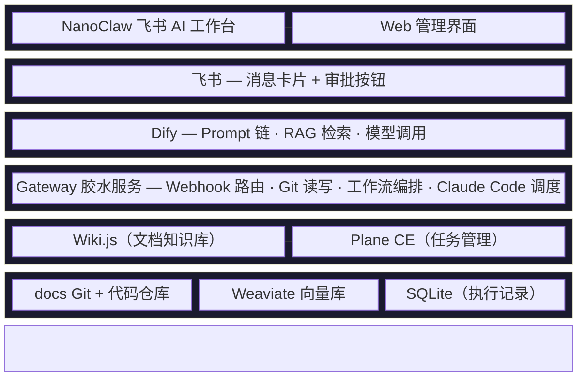
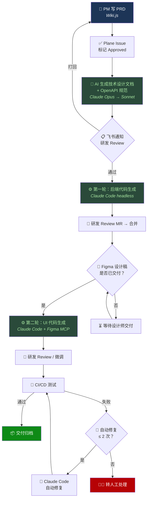
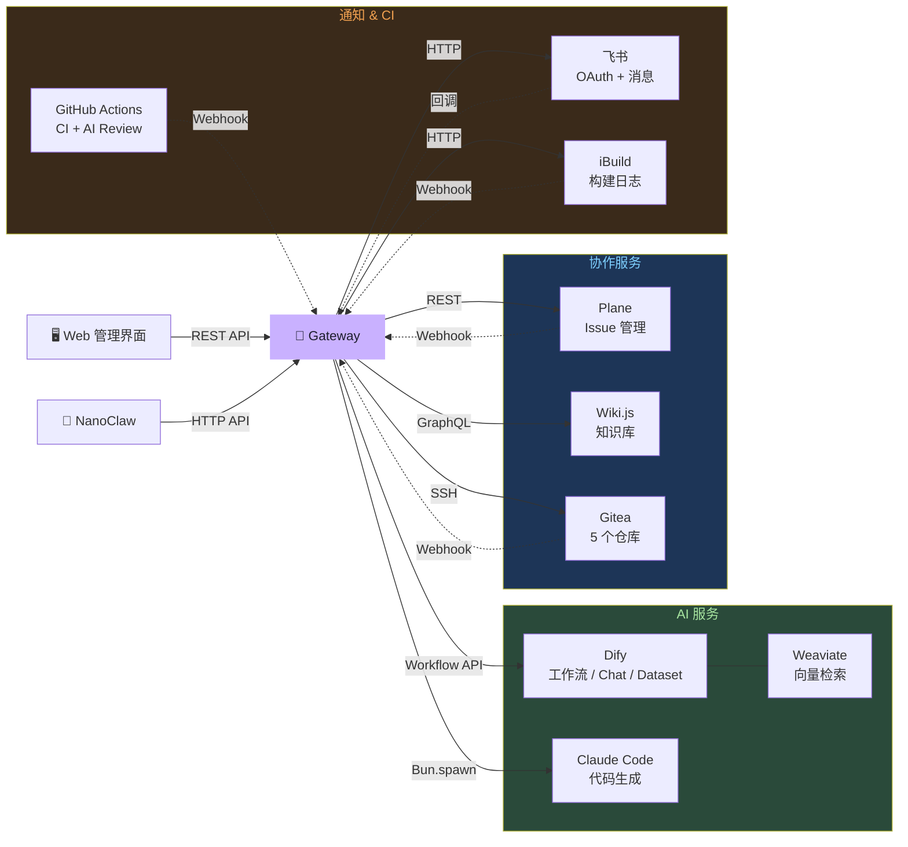

# ArcFlow

**AI 研发运营一体化平台** — 以 Markdown + Git 为数据底座、AI 为执行引擎，串联从 PRD 到代码生成的全流程。

[](https://github.com/qichen22/ArcFlow/actions/workflows/ci.yml)
[](https://github.com/qichen22/ArcFlow/actions/workflows/security.yml)
[](LICENSE)

## 项目目标

| 目标 | 说明 |
|------|------|
| **流程标准化** | PRD → 技术文档 → OpenAPI → 代码，全流程规范化，减少人工传递损耗 |
| **AI 驱动研发** | Claude Opus/Sonnet 自动生成技术文档、API 规范和代码，Claude Code 无头模式执行代码生成 |
| **知识管理** | Markdown + Git 统一存储，Wiki.js 可视化编辑，Weaviate + Dify RAG 语义检索 |
| **人机协同** | AI 生成 → 飞书通知 → 人工 Review → 审批通过 → 进入下一环节，关键节点必须人工把关 |

## 架构总览

六层架构，从上到下：



## 核心数据流



## 外部服务集成

Gateway 胶水服务是所有外部集成的中心枢纽：



> 实线 = Gateway 主动调用 · 虚线 = Webhook 回调

## AI 模型分配

| 场景 | 模型 | 调用方式 |
|------|------|---------|
| PRD → 技术设计文档 | Claude Opus 4.6 | Dify 工作流 |
| 技术文档 → OpenAPI | Claude Sonnet 4.6 | Dify 工作流 |
| CI 日志分析 / Bug 报告 | Claude Sonnet 4.6 | Dify 工作流 |
| RAG 知识库问答 | Claude Sonnet 4.6 | Dify Chat + Weaviate |
| PRD 生成对话 | Claude Opus 4.6 | Dify Advanced Chat |
| 代码生成 / Bug 修复 | Claude Sonnet 4.6 | Claude Code headless |
| AI Code Review | Claude Sonnet 4.6 | GitHub Action |
| NanoClaw 对话 | Claude Sonnet 4.6 | Agent SDK |

## 技术栈

| 层 | 技术选型 |
|----|---------|
| 后端（业务服务） | Java 17 + Spring Boot 3.x + MyBatis-Plus + MySQL 8.0 |
| Web 管理界面 | Vue 3 + Tailwind CSS 4 + Pinia + Vue Router + Tiptap + Vite |
| 移动端 | Flutter 3.x + GetX + Dio |
| 客户端 | Kotlin Android（Jetpack Compose + XML） |
| 胶水服务 | Bun + Hono + bun:sqlite（WAL 模式） |
| AI 编排 | Dify（5 条工作流 + RAG + Dataset API） |
| AI 引擎 | Claude API（Opus / Sonnet）+ Claude Code（headless） |
| 文档知识库 | Wiki.js 2.x（Git 双向同步） |
| 任务管理 | Plane CE（Webhook + REST API） |
| AI 工作台 | NanoClaw（Claude Agent SDK，飞书渠道） |
| 向量数据库 | Weaviate 1.27（Dify 自动对接） |
| CI/CD | GitHub Actions（CI + AI Review + Security）+ iBuild |

## 仓库结构

```text
ArcFlow/                                    # Monorepo（npm workspaces）
├── packages/
│   ├── gateway/                            # 🔗 胶水服务（Bun + Hono + SQLite）
│   │   ├── src/
│   │   │   ├── index.ts                    # 应用入口（Hono 挂载）
│   │   │   ├── config.ts                   # 环境变量配置（40+ 项）
│   │   │   ├── scheduler.ts                # 定时调度（RAG 同步 5min / 去重清理 24h）
│   │   │   ├── db/                         # SQLite 数据层（9 张表）
│   │   │   ├── middleware/                 # auth（JWT）/ workspace / verify（HMAC）/ dedup / logger
│   │   │   ├── routes/                     # health / auth / webhook / api / conversations / workspaces / docs
│   │   │   ├── services/                   # 14 个服务（dify / plane / feishu / git / wikijs / claude-code /
│   │   │   │                               #   workflow / rag-sync / ibuild / prd / auth / workspace-sync 等）
│   │   │   └── types/                      # TypeScript 类型定义
│   │   └── Dockerfile                      # 多阶段构建 + 非 root + healthcheck
│   └── web/                                # 🖥️ 管理界面（Vue 3 + Tailwind CSS 4）
│       ├── src/
│       │   ├── api/                        # 6 个 API 模块（auth / workspaces / workflow / conversations / docs / chat）
│       │   ├── components/                 # AppLayout（侧边栏布局）/ DocTreeItem（递归文件树）
│       │   ├── pages/                      # 11 个页面（Dashboard / Workflows / AiChat / Docs / Login 等）
│       │   ├── router/                     # Vue Router（12 条路由 + 路由守卫）
│       │   ├── stores/                     # 6 个 Pinia Store（auth / workspace / workflow / conversation / chat / docs）
│       │   └── utils/                      # 工具函数
│       └── Dockerfile                      # Nginx SPA 部署
├── setup/                                  # 第三方服务部署配置
│   ├── dify/                               # Dify + Weaviate + 5 条工作流 YAML
│   ├── plane/                              # Plane CE docker-compose + Webhook 配置指南
│   ├── wiki-js/                            # Wiki.js docker-compose
│   ├── nanoclaw/                           # NanoClaw AI 工作台部署指南
│   ├── gateway/                            # Gateway 扩展环境变量（iBuild 等）
│   ├── claude-md/                          # 4 端 CLAUDE.md 模板（backend / vue3 / flutter / android）
│   └── docs-repo/                          # docs 仓库目录脚手架
├── docs/                                   # 技术文档
│   ├── AI研发运营一体化平台_技术架构方案.md
│   ├── claude-code-github-workflow-guide.md
│   └── superpowers/
│       ├── specs/                          # 10 份详细设计规格文档
│       └── plans/                          # 实施计划文档
├── .github/workflows/                      # CI/CD
│   ├── ci.yml                              # lint + test + 覆盖率
│   ├── ai-review.yml                       # AI Code Review（Claude Sonnet）
│   └── security.yml                        # gitleaks + npm audit + license 检查
├── docker-compose.yml                      # 核心服务编排（Gateway + Web）
└── deploy.sh                               # 一键部署脚本
```

## 开发进度

| Phase | 内容 | 状态 |
|-------|------|------|
| Phase 1 | 文档基础设施：Wiki.js + docs 仓库 + CLAUDE.md + 设计规格文档 | ✅ 已完成 |
| Phase 1.5 | 胶水服务核心框架 + Web 管理界面 + CI/CD 流水线 | ✅ 已完成 |
| Phase 1.6 | Gateway Bug 修复与加固 + 服务层测试补全（62 个测试） | ✅ 已完成 |
| Phase 1.7 | Web 前端 Tailwind 重构 + 统一错误处理 | ✅ 已完成 |
| Phase 2.0 | 统一部署配置 + Plane CE 部署 | ✅ 已完成 |
| Phase 2.1 | Dify v1.13.3 + Weaviate 1.27 部署 | ✅ 已完成 |
| Phase 2.2 | iBuild CI/CD Bug 回流端点 + 41 个测试 | ✅ 已完成 |
| Phase 2.3 | PRD 智能生成 + Dify 工作流 YAML + RAG 知识库同步 | ✅ 已完成 |
| Phase 2.4 | Web 前端重设计（Linear 风格 + 飞书 OAuth + 多工作空间 + 对话 + 文档管理） | ✅ 已完成 |
| Phase 3.0 | 端到端联调：Gateway ↔ Dify ↔ Plane ↔ Wiki.js ↔ 飞书 | 🔜 下一步 |
| Phase 3.1 | NanoClaw 部署 + 飞书渠道联调 | 📋 待启动 |
| Phase 4 | 全链路端到端测试 + 生产部署 | 📋 待启动 |

### 已完成亮点

<details>
<summary><b>Gateway 胶水服务</b>（171 个测试）</summary>

- **5 条 Webhook 路由**：Plane / Git / CI-CD / 飞书 / iBuild
- **4 种工作流编排**：PRD→技术文档 / 技术文档→OpenAPI / Bug 分析 / 代码生成
- **14 个服务模块**：Dify / Plane / 飞书 / Git / Wiki.js / Claude Code / 工作流引擎 / RAG 同步 / iBuild / PRD 生成 / 认证 / 工作空间同步等
- **5 个中间件**：JWT 认证 / 工作空间权限 / HMAC 签名验证 / Webhook 去重 / 请求日志
- **9 张 SQLite 表**：workflow_execution / bug_fix_retry / webhook_event / webhook_log / users / workspaces / workspace_members / conversations / messages
- **定时调度**：RAG 增量同步（5 分钟）+ Webhook 去重缓存清理（24 小时）
- **飞书 OAuth**：兼容标准 OIDC + 旧版端点 + 私有化部署

</details>

<details>
<summary><b>Web 管理界面</b>（Vue 3 + Tailwind CSS 4）</summary>

- **飞书 OAuth 登录** + JWT 认证 + 路由守卫
- **多工作空间** 切换 + Plane 项目同步
- **Dashboard** — KPI 指标（总执行/运行中/成功/失败）+ Gateway 健康状态
- **工作流管理** — 手动触发 + 执行列表（类型/状态筛选）+ 执行详情时间线
- **AI 对话** — 多轮对话 + SSE 流式输出 + 对话管理（搜索/置顶/删除）
- **文档管理** — Tiptap 富文本编辑 + Markdown 预览 + 文件树 CRUD + 全文搜索
- **Linear 风格 UI** — CSS 变量设计令牌 + 暗色主题 + lucide 图标

</details>

<details>
<summary><b>Dify 工作流</b>（5 条 YAML 已就绪）</summary>

1. **PRD → 技术设计文档**（Claude Opus）— 数据库设计 / 接口设计 / 分层说明
2. **技术文档 → OpenAPI**（Claude Sonnet）— RESTful / Result\<T\> 封装 / 分页模式
3. **CI Bug 分析**（Claude Sonnet）— 根因分析 / 严重级别 P0-P2 / 修复建议
4. **PRD 生成对话流**（Claude Opus）— 多轮对话 / 自动生成 PRD 模板
5. **RAG 知识问答**（Claude Sonnet）— 向量 + 关键词混合检索

</details>

<details>
<summary><b>CI/CD 流水线</b></summary>

- **CI**：PR 触发 lint + test + 覆盖率检查（Gateway 50% 阈值）
- **AI Code Review**：`ai-review` 标签触发 Claude Sonnet 审查（OWASP / 逻辑 / 性能）
- **Security**：Gitleaks 密钥扫描 + npm audit + 许可证白名单检查
- **安全策略**：Fork PR 需 `approved-for-ci` 标签，Dependabot 自动合并

</details>

## 下一步工作方向

基于架构分析，当前优先级最高的工作：

1. **端到端联调**（Phase 3.0）— 当前最关键的里程碑
   - 配置 Plane Webhook + Approved State ID → 验证 Issue 审批触发工作流
   - 导入 5 条 Dify 工作流 YAML + 配置 API Key 映射 → 验证 AI 文档生成
   - 配置 Wiki.js Git 存储后端 → 验证文档双向同步
   - 配置飞书 App 凭证 → 验证 OAuth 登录 + 消息卡片推送 + 审批回调
   - 补齐 Gateway API 认证覆盖（当前 docs/workflow 等路由缺少 JWT）

2. **NanoClaw 部署**（Phase 3.1）
   - 部署 NanoClaw Fork 到服务器
   - 配置飞书 Webhook + 群注册
   - 测试意图路由（任务创建 / 工作流触发 / 文档查询）

3. **已知技术债务**
   - Dify RAG Dataset ID 硬编码，需支持多工作空间动态绑定
   - PRD 文件路径从 Issue 描述提取使用正则，需要更健壮的约定
   - iBuild CI/CD 集成仅有框架，未联调

## 快速开始

```bash
# 克隆仓库
git clone https://github.com/qichen22/ArcFlow.git && cd ArcFlow

# 安装依赖
bun install

# 启动 Gateway 开发服务器
cd packages/gateway && cp .env.example .env && bun dev

# 启动 Web 开发服务器（另一个终端）
cd packages/web && cp .env.example .env && bun dev

# 运行测试
bun test

# 部署第三方服务
cd setup && cp .env.example .env && ./deploy.sh up
```

## 参与开发

请阅读 [CONTRIBUTING.md](.github/CONTRIBUTING.md) 了解分支策略、PR 工作流和 Code Review 流程。

## License

[MIT](LICENSE)
